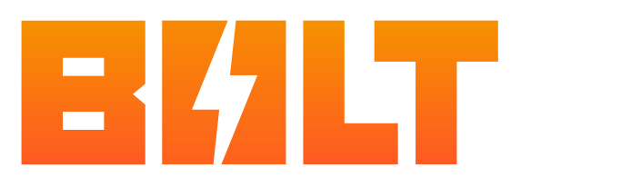

this extention was built with Bolt CEP.

## AEAI Helper

This extention for After Effects implements a gemini chatbot that can analyze your composition's frame to generate a response that can help you with virtually anything!

Use AEAI Helper to help you make a frame more cinematic, sad, happy, or... _anything!_

### Compatibility

- [Adobe CC Apps](https://www.adobe.com/creativecloud/desktop-app.html) version 2023 or later
- Windows & Mac Intel
- Mac Arm64 (M1-M4) require special setup ([more details](#misc-troubleshooting))

## Support

### Installation Support 🙌

install [ZXP/UXP by aescripts.com](https://aescripts.com/learn/post/zxp-installer) to use this extension

launch the program, and then drag and drop the **"AEAIHelperCEP.zxp"** from the [release page](https://github.com/gaknippel/AEAIHelper/releases/tag/v1.0.1) into the program, and install it.

finally, simply launch after effects and go to Window > Extensions > gemini CEP to open the extension.

If you have questions with getting started using AEAI Helper, contact me @ _gaknippel@hotmail.com_

## Can I use AEAI in my free or commercial project?

Yes! AEAI Helper is **100% free and open source**, being released under the MIT license with no attribution required. This means you are free to use it in your free or commercial projects.

I would greatly appreciate it if you could provide a link back to my tool's info page in your product's site or about page:

## Follow me on YouTube!
[My channel:](https://www.youtube.com/@critterfarts) I make souls-like videos and shorts, and just clips of me and my friends messing around 😃

